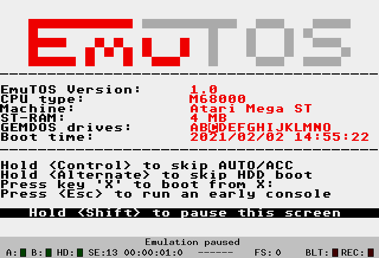
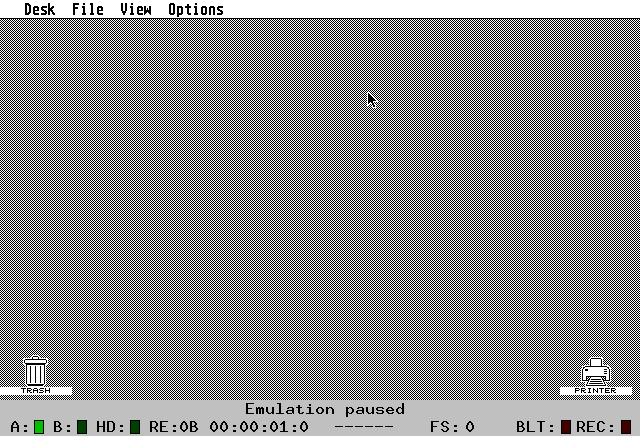

Welcome!

This is a work in progress, as is EmuTOS itself. Please bear with us as we improve it. Contributions are welcome.

[TOC]

# Introduction #

EmuTOS is a single-user single-tasking operating system for 32-bit Atari computers, clones and emulators. It can be used as a replacement for the TOS images typically needed by emulators and can also run on some real hardware, including the Atari ST(e), TT, and Falcon, and the FireBee. It can even run on non-Atari hardware such as Amiga and ColdFire Evaluation Boards.

# License #

All the source code is open and free, licensed under the GNU General Public License (GPL), Version 2, June 1991. The text of the license is in the [distribution](#docFiles).

> Erm, what is our license for this document? Gnu FDL? Creative Commons License?

# Audience #

This manual is for EmuTOS users. For more on EmuTOS, see the [web site](https://emutos.sourceforge.io).

## What This Manual Covers ##

This manual describes EmuTOS Version 1.0.1.

## What This Manual Doesn't Cover ##

Getting the current git repository, or compiling the source. However, you can get the source for recent releases. See [Available Archives](#available-archives).

Specific hardware. EmuTOS expects certain hardware, for example a 680x0 or ColdFire processor. It runs on Atari ST hardware, some Amigas, and a variety of other machines that roughly emulate the Atari ST. It also runs on a number of emulators, such as Hatari and ARAnyM. Since this is a wide variety of hardware, we refer you to the documentation for that hardware.

### Documentation in the Distribution ###

<a id="docFiles"></a>There is a directory in the distribution (see [Getting EmuTOS](#getting-emutos)), ``/doc``, which has more documentation.

| File | Description |
|-----------|-----|
| [announce.txt](https://raw.githubusercontent.com/emutos/emutos/master/doc/announce.txt) | A summary of EmuTOS, including more technical information that what is here. |
| [authors.txt](https://raw.githubusercontent.com/emutos/emutos/master/doc/authors.txt) | Contributors to EmuTOS and a wee bit of the history. |
| [bugs.txt](https://raw.githubusercontent.com/emutos/emutos/master/doc/bugs.txt) | A list of known bugs, including bugs that are known to exist in TOS. Also see ``incompatible.txt``, below. Please read before you file a [bug report](#reporting-bugs). |
| [changelog.txt](https://raw.githubusercontent.com/emutos/emutos/master/doc/changelog.txt) | Changes from release 0.9.4 until the current version. |
| [emudesk.txt](https://raw.githubusercontent.com/emutos/emutos/master/doc/emudesk.txt) | A list of features, including those from the TOS desktop, implemented in the current release. Also, notes as to which features are not implemented, or partially implemented in the 192KB [ROMs](#rom). Also some information on advanced features not covered here, such as user-assignable icons. |
| [incompatible.txt](https://raw.githubusercontent.com/emutos/emutos/master/doc/incompatible.txt) | A list of programs known to be incompatible with EmuTOS, some workarounds, and explanations as to why they might be incompatible. Please read before you file a [bug report](#reporting-bugs). |
| [license.txt](https://raw.githubusercontent.com/emutos/emutos/master/doc/license.txt) | The GNU General Public License, Version 2, June 1991 |
| [status.txt](https://raw.githubusercontent.com/emutos/emutos/master/doc/status.txt) | The status of EmuTOS support for various bits of hardware and emulators, and implemented functions. Please read before you file a [bug report](#reporting-bugs). |
| [todo.txt](https://raw.githubusercontent.com/emutos/emutos/master/doc/todo.txt) | Things to do. Volunteers are welcome. |
| [xhdi.txt](https://raw.githubusercontent.com/emutos/emutos/master/doc/xhdi.txt) | Notes on when certain entities were available in TOS, and their status under EmuTOS. |

## Typography ##

In this manual, a caret (^) indicates a control character. For example, ^I means hold down a control key and press the i key. The shift key is optional.

# Compatibility #

A list of programs that are known to be [incompatible with EmuTOS](https://github.com/emutos/emutos/blob/master/doc/incompatible.txt) is in the source tree. Often, these programs take advantage of undocumented aspects of TOS. These often break on different versions of TOS, sometimes on different languages in the same version of TOS, as well as on EmuTOS. Please check this list before reporting an EmuTOS bug.

Hatari users will find the [Hatari and EmuTOS](https://hatari.tuxfamily.org/doc/emutos.txt) document useful. However, check for the most [recent versions of EmuTOS](https://emutos.sourceforge.io/download.html).

# Getting EmuTOS #

You can get the current release from the [EmuTOS web site](https://emutos.sourceforge.io/download.html). There are many files available for each version. Which one you want depends on the hardware you are using. For example, emutos-aranym-*.zip files are for the ARAnyM emulator.

Thos who wish to live dangerously can also get a recent [snapshot](https://sourceforge.net/projects/emutos/files/snapshots/).

We highly recommend testing the zip file after you pull it in. E.g. on Linux:

```
unzip -t file-name
```

## Available Archives ##

These are the zip archive files available for download, where X.Y indicates the current release version. See below for how to use some of them. The source is also available from a git repository, which is beyond the scope of this document.

Multi-lingual versions will have multiple files. There are two differences: the language, Czech, French, etc., and the television format (NTSC or PAL) your hardware supports, if any. See the `readme.txt` file in the root directory of the zip file.

| File name                   | Use                                                                            |
|-----------------------------|--------------------------------------------------------------------------------|
| emucon-X.Y.zip              | [EmuCON](#EmuCON) shell program as separate executable                                             |
| emutos-1024k-X.Y.zip        | One megabyte multilingual [ROM](#read-only-memory) image. As Atari does not support 1 MB images, this is for Hatari.|
| emutos-192k-X.Y.zip         | 192 kilobyte limited [Atari ROM](#read-only-memory) image                      |
| emutos-256k-X.Y.zip         | 256 kilobyte [Atari ROM](#read-only-memory) image                              |
| emutos-512k-X.Y.zip         | 512 kilobyte [Atari ROM](#read-only-memory) image                              |
| emutos-amiga-floppy-X.Y.zip | [Amiga floppy diskette](#amiga) image                                          |
| emutos-amiga-rom-X.Y.zip    | [Amiga ROM](#amiga) image                                                      |
| emutos-aranym-X.Y.zip       | ARAnyM (emulator) image                                                        |
| emutos-cartridge-X.Y.zip    | [Atari cartridge image](#cartridge) ([EmuCON](#EmuCON) only)                              |
| emutos-firebee-X.Y.zip      | FireBee executable                                                             |
| emutos-floppy-X.Y.zip       | EmuTOS in an [Atari floppy diskette image](#hard-or-floppy-drive)              |
| emutos-m548x-bas-X.Y.zip    | For M548x evaluation boards produced by Freescale, with ColdFire CPUs. |
| emutos-m548x-dbug-X.Y.zip   | For M548x evaluation boards produced by Freescale, with ColdFire CPUs. |
| emutos-pak3-X.Y.zip         |                                                                                |
| emutos-prg-X.Y.zip          | EmuTOS as an [Atari executable](#hard-or-floppy-drive)                         |
| emutos-src-X.Y.tar.gz       | Source code for this version, including some documentation not found elsewhere |

# Installation #

In many cases, installation of a new operating system is covered by the hardware documentation.

## Atari ##

No-one at Atari anticipated that thirty years on people would still be hacking Atari computers, so they made little provision for upgrading their operating systems. But you can! Downloads are available at the [EmuTOS download](https://emutos.sourceforge.io/download.html) web site.

### Hard or Floppy Drive ###

Installation on Atari hardware can be as simple as putting the right file in the right place. The existing operating system, typically TOS, boots, and as part of its boot process, executes whatever it finds in ``C:\AUTO``. The prg version of EmuTOS provides an executable, ``EMUTOS*.PRG``, which you can copy into ``C:\AUTO``. Or you can put it any place convenient, and launch it at will.

The floppy version of EmuTOS provides a floppy disk image with a hidden ``.SYS`` file in its root directory.

Hard drive or floppy is slower than booting from [ROM](#rom) and uses main memory, so use it to try EmuTOS (or a new version of EmuTOS).

Get the emutos-prg-\*.zip or emutos-floppy-\* archive. See the readme.txt file in the archive for more information.

### Read Only Memory ###

Almost all Atari STs came with TOS in [read only memory (ROM)](#rom). Only a few very early ones expected to boot the operating system from mass storage, meaning, in those days, floppy disk. EmuTOS is not specific to any particular version of Atari hardware, except for the ROM space available. You will have to select the size of the EmuTOS image to download and burn to ROM (or, more likely, [EPROM](#eprom)). If you are using an emulator, see the emulator's documentation for installing a new ROM image.

Get the emutos-XXXk*.zip file, where XXX is the size ROM of your hardware. For emulators, consult the emulator's documentation. Note that the 192K ROMs do not provide [EmuCON](#emucon) or a number of desktop features, so you may prefer the 256K or 512K ROMs if your hardware will support them. However, you can add EmuCON to a disk with the ``emucon-X.Y.zip`` archive.

The 68000 has a 16 bit wide data bus. Because of that, ROM images have to be split into at least two files, one for each EPROM. Doing that requires special software, and is beyond the scope of this document.

### Cartridge ###

There is also a cartridge version, which goes in the game cartridge on Atari hardware. Due to the limited space available, it is English only and has no [AES](#aes) or desktop. It contains [EmuCON](#emucon) only, no GUI or desktop. For these reasons we suggest it only for very tight memory situations, or in the unusual case of bringing up new hardware.

Get the emutos-cartridge*.zip file. See the readme.txt file in the archive for further instructions.

## Amiga ##

## Other Hardware ##

# Booting #

Successful initialization after power up or a hard reset will produce a screen similar to this one.



*Above: EmuTOS boot screen on an RGB screen*

The normal boot sequence is to initialize the hardware, then the operating system in [ROM](#rom). If there is a game cartridge present, control passes to it. Otherwise the OS looks for a hard drive. If it finds one, it runs programs in ``C:\AUTO`` and loads accessories in ``C:\``. If there is no hard drive, the operating system looks for a floppy drive at A:. If it finds A:, the OS executes programs in ``A:\AUTO`` and loads accessories in ``A:``. However, you can bypass portions of that sequence as noted below.

There are a number of features to note about the boot screen.

- Probably the most important is that if you want more time to study the boot screen, you can hold a shift key down.

- The version of EmuTOS that is booting. This shows major and minor revision numbers (e.g. 1.3) and the patch number if one is present (e.g. 1.3.2).

- The type of CPU found, in this case a Motorola 68000.

- The hardware found (or, as in this case, emulated), in this case an Atari Mega ST.

- How much main memory was found, 4 MB in this example.

- An enumeration of the floppy drives (A and B) and hard drive partitions found. The boot drive (here, ``C:``) is in reverse video.

- The time and date of the boot if EmuTOS finds a real-time clock. If no real-time clock is found, a bogus time and date will be shown in reverse video.

- Some useful functions:

    - Hold a control key down to bypass the ``C:\AUTO`` directory and installing [accessories](#desktop-accessories). This is useful for debugging complicated boot sequences.

    - Hold down an Alternate key to bypass booting from a hard drive. This would allow booting from a floppy drive if one is present, or from [ROM](#rom).

    - To boot from any drive, press its letter. For example, to boot from I: press the i key. This allows for different custom setups.

    - Press the escape key to bypass the desktop and go directly to [EmuCON](#emucon). This might be useful for recovering from a boot sequence gone wrong.

# Rebooting #

There are two ways to reboot EmuTOS. Consult your hardware or emulator documentation for how to achieve them.

A hard reboot clears everything that has been done since power up. A hard reboot is comparable to powering down and up again. This is achieved with the reset button on most hardware. In EmuTOS, as in some versions of TOS, you can achieve a hard reboot with Ctrl-Alt-Shift-Delete. A [boot screen](#booting) is shown. A hard reboot returns to [ROM](#rom), so if you are running EmuTOS from a disk drive, you will have to launch it again from whatever OS is in ROM.

A soft reboot (Ctrl-Alt-Delete) stops the current program and returns control to EmuDesk. No [boot screen](#booting) is shown, and EmuTOS goes directly to EmuDesk.

# The Desktop #



*Above: EmuTOS minimal desktop screen on a monochrome screen*

EmuDesk implements all of the features of the Atari TOS 2/3/4 desktop. And it has features TOS does not have.

Due to space limitations, the desktop implementation is somewhat restricted in the 192K [ROMs](#rom). For the gory details, see the file ``doc/emudesk.txt`` in the archive.

If you make any changes to the desktop using the above features, you must [save the desktop](#saving-the-desktop) to preserve the changes.

## Minimal Desktop ##

If you have a minimal Atari system, this screen shot is what you will see: a plain desktop. It's not very interesting. Still, a few things to note.

You can bring the mouse pointer up to the Desk entry in the navigation bar. That will show you the Desk menu, with one entry: "Desktop info...". Click on that to see information about EmuTOS, including the version number.

The File menu will let you format a floppy, which isn't very useful without a floppy drive. It will also let you enter [EmuCON](#emucon). If [NatFeats](#natfeats) are enabled, you can use the last entry to power off your computer (or exit your emulator).

The View menu lets you select how you seen directories. You can also set the background and you can set a number of other preferences. You can also read a ``*.INF`` file, which is a desktop information file, similar to the Atari TOS ``DESKTOP.INF`` file. EmuTOS uses ``EMUDESK.INF``.

**Note** EmuTOS will always create a printer and trash icon if it does not see ``EMUDESK.INF``. If you don't have a printer, the icon is harmless, and you can always remove it. If you do, [save your desktop](#saving-the-desktop).

## Floppy Disk Only Desktop ##


*Above: EmuTOS minimal desktop screen with a floppy disk icon visible.*

If you have one floppy disk drive, you get one floppy disk icon on the desktop. Unlike TOS, EmuTOS does not support emulating floppy drive B: in physical floppy drive A:. Again, unlike TOS, if you have only one floppy drive, you will see only one floppy drive icon.

**Note** We recommend you consider mass storage other than floppy drives. You can now buy add-ons for Atari STs that emulate floppy drives and hard drives using solid state memory.

Now the File menu is more interesting. You can do a lot of typical file manipulations.

## Hard Drive ##


## Using the Desktop ##

Using a new (to you) computer is a bit like moving into a new home. "Where did we put that..." This section will walk you through some typical operations and some things that may make life a bit easier.

Many options also have shortcut keys, e.g. ^S to save the desktop. You can note these to the right of the menu entries.

Unlike TOS, EmuTOS recognizes hard drives attached to the system, so you don't have to install them. It will recognize ASCI (Atari's version of SCSI), SCSI and IDE drives if present and if EmuTOS supports the hardware. EmuTOS also recognizes some partitioning schemes, such as that of the IDC SCSI Host adapter. It will install icons on the desktop for the drives it recognizes.

### Saving the Desktop ###

As you move in to EmuTOS, you will change how the desktop works, such as how you want to sort directories. You can preserve those choices across boots by saving the desktop. Hit ^S or go to Options -> Save Desktop. EmuDesk will ask you to confirm. Click on OK, and you are done.

### Opening a Disk Drive or Directory ###

To open a window on a disk drive, double click on its icon. Or hit an Alt key and the drive letter, e.g. Alt g to open G:. To view any directory (folder), double click on its entry. Note that in text view mode, directories are identified by a small icon to the left of the name of the directory. In icon view mode, they have a manila folder icon, rather than the piece of paper icon files get.

If you save the desktop with windows open to directories, you will preserve those open windows across boots. This is handy for directories you use a lot.

Folder windows have several widgets of interest.

* Scroll bars on the right and bottom allow scrolling. Click on the scroll bar for gross movement, or on the arrows at the ends of the scroll bar for fine movement.

* The title bar, across the top, has the path to the current directory, e.g. `C:\AUTO\*.*` or `C:\*.*`. You can specify which files will show up in the window by [setting the file mask](#file-mask). The title bar shows the selected file mask.

    To move the window around on the desktop, click and drag the title bar.

* In the upper left-hand corner is the folder button. Clicking on this goes up a folder in the hierarchy. At the top folder of a partition, it will close the window. You can also go up a folder with File -> Close folder (^H). You can close a window regardless of where in the file hierarchy it is with File -> Close top window (^U).

* To toggle full screen mode, click on the upper right full screen button.

* To manually re-size, click on the lower right and drag as needed.

* To execute a program, double click on it. If it has the TTP (TOS Takes Parameters) extensions, EmuTOS will ask for parameters. Clicking on the OK button or hitting the Return or Enter key will execute the program with whatever parameters you have given it. If the program is of type PRG, EmuTOS will simply execute it.

* To display any non-program file, double click on it. You can send it to your printer. Or you can show it. EmuTOS will display it one screen at a time. Use the space bar to see the next screen. Use the Return or Enter key to advance one line. Q bails out of showing the file.

* If you have multiple windows open, you can cycle through all of them with File -> Cycle windows (^W). On a crowded desktop, this is a great convenience.

### File Selection ###

You can select one file by clicking on it. Select multiple files within the same window by selecting the first, then hold the shift key down while you click on other files (Shift Click). There is no way to select a range of files. You can narrow the visible files by [setting the file mask](#file-mask). You can select all the files in the current window with File -> Select All Items (^A). Having done that, you can then use Shift Click to deselect items.

If you then select an operation, the dialog you then select will walk through the files you have selected. For example, select several files and directories. Then look at the information on them with ^I. The Skip button at the bottom lets you skip a file or directory, whereas the OK button accepts your changes, and the Cancel button lets you end the sequence.

### Manipulating Files and Directories ###

Once you have selected one or more files, you can copy them to another window by dragging them to the new window. You can move them by holding down a control key while you drag.

* To create a new folder, File -> New Folder (^N).

* To search for an item in the current window, File -> Search (^F).

    This prompts for a search string, then searches for matching files and folders.  The search string entered is not the usual TOS [wildcard](#wildcards) specification: any characters you enter must be matched, but missing characters are ignored, i.e. are treated as though they were wildcards. For example, searching for "A.T" will match "A.T", "ABC.TTP", etc. To search for "A.T", you would enter exactly that. Entering the period moves to the extension part of the file name. So "A.T" is the equivalent of "A\*.T\*.

    If there are no icons currently selected, Search just selects all matching files and folders in the topmost window, and the search ends.

    Otherwise, the folders corresponding to the selected icons are searched recursively, in sequence.  If a folder contains a matching name, the folder is displayed in a window, with the matched files selected, and the user is prompted to continue to search or cancel.

    If cancel is selected, the search ends, with the window showing the most-recently-matched files; otherwise, the search continues.  When all folders have been searched, an alert is displayed: either "No more files" if at least one file was found, or "xxx not found" if no matching files were found.

* To close a window using the GUI, you have to click repeatedly on the upper left widget in the window, once for each level in the directory tree. Instead, use File -> Close top window (^U). Or you can close the current folder and go up a level with File -> Close folder (^H).

* You can delete a file, a directory or recursively delete a whole directory tree. Select the item to delete. You can then drag it to the trash icon, or use file -> Delete (^D).

**Note** Be careful with deletion! There is no "undo".

Note that the common shortcuts ^C (for copy) and ^P (for paste) don't work for copying files or directories.

### File Information ###

EmuTOS, like Atari TOS, uses the FAT file system, common on MS-DOS and Windows systems of the day. Thus file attributes are a bit different from those of modern operating systems. There is only one date, the date the file was last modified. Files may be marked h, for hidden; s, for system; and r, for read-only.

There is also an archive flag. When set, this file has been changed since the last archive was made. Backup software can use this bit to archive only changed files, and then reset the flag. But neither EmuDesk nor EmuCON will allow you to edit this flag.

The File Information dialog (File -> Info/Rename, ^I) will show you its name (with the option to change it), size, date and time, and whether a file is read-write or read only.

If you are looking at a folder (directory), the dialog will show you the number of files and folders within it, as well as the time and date.

For partitions or floppy diskettes, you will see the drive identifier (e.g. A for a floppy drive), the disk label, the numbers of files and folders, and the space used by files (not directories, or metadata), and the available space (in bytes).

### File Mask ###

You can set the mask for displaying files in the folder windows: File -> Set file mask... . For example, if you set the file mask to *.PRG, you will only see executable program files with the extension .PRG. (You won't see other executables such as TTP.) The traditional [wild cards](#wildcards) work. The title bar shows the file mask.

## What You See ##

The View menu lets you change how you see files in folder windows.

### Icons vs. Text ###

In the View menu, you can select showing files as icons or as text.

- There are several special icons for directories and special types of files, such as executables. You can [add custom icons](#add-an-icon).

- Text mode shows file names and information about each file: length, and time and date modified. Directories, system files, and read-only files get small icons along the left column of the window.

### Sort Order ###

You can also select how EmuDesk will sort the files in a folder: by name, type (extension), size and date. Directories are always sorted to the top, then files. There is no option to reverse the sort order.

There is also an option to not sort at all. This option shows you the files as they are in the directory. This is particularly useful in arranging the ``\auto`` folder of your boot disk, because at [boot time](#booting) EmuTOS will execute the files there in the order it encounters them in the directory. The sort order options apply whether you display files as text or icons.

## Customizing the Desktop ##

Use the Options menu to customize the desktop.

### Add an Icon ###

To add icons to your desktop or edit existing ones, use Options -> Install Icon... . Note that for drive icons, the identifier is one capital letter, for example, Z. You can also add or edit the label. So instead of "Disk J", you can have "Development" for your software development drive. These can be aliases of the existing lettered drives, so that, say, "DISK C" and "Development" open the same drive. Depending on the icon you select, the drive letter (if any) may show up above and to the left of the icon.

### Add an Application ###

You can set up one or more applications as desktop icons. Select the executables. Then select Options -> Install application... . Supply any command line arguments.

To associate an extension with a given application, enter that extension in the "Document type". For example, if you have a text editor, you can enter TXT there. Then clicking on any file with that extension will fire up the application and EmuTOS will give that application the file you clicked on as its first command line argument. [Wild cards](#wildcards) are allowed. Entering * or ??? will make this application the default viewer for file types not otherwise associated with an application.

"Install as" lets you assign a keystroke to the application, such as function key 1, F1. Accepted values are 1 to 20, where 1 to ten is the function key with no modifier keys, and 11 to 20 indicate shifted function keys. So 12 indicates Shift-F2.

"Boot status": Select "Auto" to autoboot this application. Since only one autoboot application is allowed, if you set "Auto" for an application, EmuTOS will automatically disable "Auto" for any existing autoboot application.

"Application type": Selecting TOS or TTP will launch the program in text mode; GEM or GTP will launch the application in graphics mode. The appropriate value will be prefilled according to the type of application selected, and you should not normally change it.

"Default dir" specifies the default directory when the application is launched: either the directory of the application itself, or the top window (i.e. the directory of the data file). The one to choose depends on the specific application. If the application has supporting files (such as resource or help files), it typically will look for them in the default directory. For such an application, you will need to specify a default directory of "Application". Otherwise, specify "Window".

When a program is launched due to it being an installed application, the desktop provides the application with the name of the data file that caused the launch: this is known as a parameter. In most cases, the application expects that the full path of the data file will be provided. Some (usually older) programs may expect the filename only. Unless the application's documentation indicates otherwise, you should normally try "Full path" first; if that does not work, you can try "File name", although that may require you to modify the "Default dir" specified above.

You can set the defaults for some of this with the [Desktop configuration](#desktop-configuration) dialog.

### Restoring Your Desktop ###

If you do lots of experiments and end up with a cluttered desktop, you can get back to your original desktop by [rebooting](#rebooting). A much faster way to restore your desktop to its last saved state is to re-read the appropriate ``C:\*.INF`` file. Options -> Read .INF file...

This also lets you have multiple desktops. The easiest way to have multiple desktops is to keep them in ``C:\`` and use the extension ``.INF``. ``GAMES.INF``, ``DEVEL.INF``, and so on, limited only by the eight characters in the base part of the file name.

### Preferences ###

Use the Options -> Set preferences... dialog to have GEM confirm file deletions, copies or overwrites.

Select More preferences to set how quickly GEM decides you have double clicked on something rather than two separate clicks, whether you have to click on a menu to get it or just mouse over it, and the time and date formats.

### Desktop Configuration ###

The two top pairs of radio buttons apply to programs which have not been [installed](#add-an-application). They specify behavior that applies when applications are launched, say via function key or by drag-and-drop. (Installed applications have the same two buttons that apply on a per application basis.)

The topmost pair allows you to specify which will be the current directory when an application starts.  "Application" means the directory containing the application; "Window" means the currently-topped window.  This can matter (depending how the application is written), e.g. when a program tries to load a resource or configuration file.

The next pair of radio buttons specifies how the filename argument is passed to an application when launched by drag-and-drop.  "Full path" means that the fully-qualified file name is passed (e.g. ``D:\SOMEDIR\AFILE.DAT``). "File name" means that only the file name is passed (e.g. ``AFILE.DAT``).

In the process of [adding an application](#add-an-application) to the desktop, you can assign a function key to it. You can inspect and change those assignments. Accepted values are 1 to 20, where 1 to ten is the function key with no modifier keys, and 11 to 20 indicate shifted function keys. So 12 indicates Shift-F2.

You can re-assign shortcut keys to menu entries.

Finally, the Desktop Configuration window shows you how much free RAM you have available.

### Blitter ###

The menu option Options -> Blitter lets you turn the blitter chip on or off, if you have one. Some programs (typically games) have problems with the blitter, so turning it off can help those programs.

### Cache ###

If your processor has a hardware cache, you can disable and enable it here. If not, this menu entry is greyed out. Some programs do not work correctly with cache, so EmuTOS lets you disable it.

## Desktop Accessories ##

Desktop Accessories are programs that stay resident in memory, and are available from the Desktop menu. They have an extension of ``.ACC``. To activate, put the file in the root directory of your boot drive, and reboot.

To deactivate, change the file extension, for example to ``.ACX``, or move it to a different directory, then reboot. Or simply reboot and boot from a different drive. You can also hold a control key down while booting to bypass loading accessories and the ``C:\AUTO`` directory.

**Note** Desktop accessories take up memory even when you aren't using them. Choose wisely.

## Control Panel eXtensions ##

Control Panel eXtensions (CPXs) are short programs that extend the control panel. They terminate and stay resident, much like [desktop accessories](#desktop-accessories).They are available in some versions of TOS, and in EmuTOS.

The Control Panel is a special type of accessory that was originally provided by Atari. However, third-party versions are also available.

# EmuCON #

EmuCON2 is a basic but useful command-line interpreter, written from scratch by Roger Burrows in 2013 to replace the original EmuTOS CLI.

It requires approximately 30 kilobytes, and works with Atari TOS as well as EmuTOS. Command line re-direction works for standard out, but not for standard in or standard error. [Wild cards](#wildcards) also work. EmuCON is not case sensitive, but the FAT file system does not preserve case. For example:

```
C:\>echo foo > bar.txt
C:\>ls bar*.*
BAR.TXT
C:\>cat bar.txt
foo
C:\>
```
Given part of a file name or path, EmuCON will do a C Shell or DOS style tab completion. That is, enter part of a path, and hit tab. The shell will cycle through one or more possible completions. Any other character adds that character to the path. You can use this repeatedly to build up a long path fairly easily.

EmuTOS's built-in VT-52 emulator respects the RS-232 flow control characters, ^S to stop, and ^Q to resume. ^C will (usually) stop a program.

The built-in commands are:

| Command   | Usage |
|-----------|-------|
| cat/type  | Show a file. Like Unix's ``cat`` and DOS's  ``TYPE``. They simply send all of the file to the screen. See ``more`` below.|
| cd        | Change directory. If you begin with a drive letter, e.g. ``D:``, you can change to a different partition. |
| chmod     | Change the permissions on a file. These are the FAT permissions: h, for hidden; s, for system; and r, for read-only. Use MS-DOS syntax for the permissions, not Unix. |
| cls/clear | Clear the screen and home the cursor. |
| cp/copy   | Copy a file. See ``mv``/``move`` below. |
| echo      | Sends everything after it on the line to the display. |
| exit      | Leave EmuCON. |
| help      | Show a list of built in commands (this table). Given a command as an argument, show a brief summary of that command's usage. |
| ls/dir    | Show a directory listing. Given a path, display that file or directory. Unlike EmuDesk, EmuCON's ls will show hidden files. |
| mkdir/md  | Make a directory. |
| mode      | Set characteristics of the "terminal", e.g. screen resolution. |
| more      | Display a file one screen at a time. Use the space bar to see the next screen. Use the Return or Enter key to advance one line. Q or ^C bails out of showing the file. |
| mv/move   | Move a file. See also ``cp``/``copy`` above. |
| path      | Set a search path, analogous to the PATH environment string in DOS or Unix. You may specify multiple folders separated by a semicolon (;). |
| pwd       | Print the working (current) directory. |
| ren       | Rename (move within the working directory). It will not rename directories on versions of GEMDOS less than 0.15 due to a bug in those versions of GEMDOS. |
| rm/del    | Remove or delete the given file(s), but not directories. |
| rmdir/rd  | Remove or delete the given empty directories. |
| show      | Show information about the given drive. |
| version   | Show the current version of GEMDOS (not the same as the current version of EmuTOS). |
| wrap      | Turn screen wrapping on or off, or show its current state. |

The `help` command shows the (above) list of commands, or individual help for a specific command, like this:

```
C:>help show
show [<drive>]
    Show info for <drive> or current drive
```

EmuCON is not provided in 192K [ROMs](#rom). However, you can add it to a disk with the ``emucon-X.Y.zip`` [archive](#available-archives).

# Reporting Bugs #

Before you report a bug, you should search the EmuTOS [development mailing list's archives](https://sourceforge.net/p/emutos/mailman/emutos-devel/) to see if anyone else has reported your problem or something similar, and a possible solution. You should also check certain [documentation files](#docFiles) in the most recent distribution or the git repository.

To report bugs, or for other discussion about EmuTOS, please join the EmuTOS [development mailing list](https://sourceforge.net/projects/emutos/lists/emutos-devel). There are other, deprecated, ways to file bugs, but this allows anyone to join the discussion, and will usually get a faster response.

# Glossary #

* <a id="aes"></a>AES: *Application Environment Service*, the highest level graphic environment in EmuTOS.

* <a id="eprom"></a>EPROM: *Erasable Programmable Read Only Memory*, reprogrammable [ROM](#rom). Generally more useful than ROM in experimental situations. In this manual we will use the terms interchangably.

* <a id="natfeats" ></a>[NatFeats](https://github.com/aranym/aranym/wiki/natfeats-proposal): *Native Features* support. These are features that some emulators provide (rather than requiring the OS to implement them in 68000 code which must then be emulated). EmuTOS supports a subset of them. See your emulator's documentation for details.

* <a id="rom" ></a>ROM: *Read Only Memory*, usually not reprogrammable. See also [EPROM](#eprom). In this manual we will use the terms interchangably.

* <a id="vdi"></a>VDI: *Virtual Device Interface*, provides low level drawing (lines, polygons, etc.), font support, and handles user events such as mouse clicks.

* <a id="wildcards"></a>Wild card: A wild card lets you select multiple characters, and in EmuTOS they are often used in file selections. EmuTOS allows two wild cards. * means the file selection software will accept any legal character from this position to the end of the field. So ``*.WPF`` would find all files with that extension. ? is a wild card for that one character position. So ``A?C.C`` would select all files that have a three letter name with A in the first place, any character in the second, C in the third place, no other characters in the name, and an extension of "C". 

# Resources #

Also see the [EmuTOS links page](https://emutos.sourceforge.io/links.html).

* Documentation included in the [distribution](#documentation-in-the-distribution) and the source.

* The [EmuTOS web site](https://emutos.sourceforge.io/).

* The [EmuTOS mailing list](https://sourceforge.net/p/emutos/mailman/emutos-devel/ "EmuTOS mailing list").
